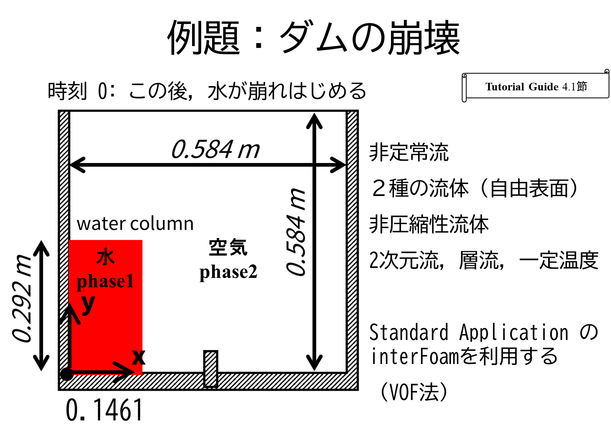
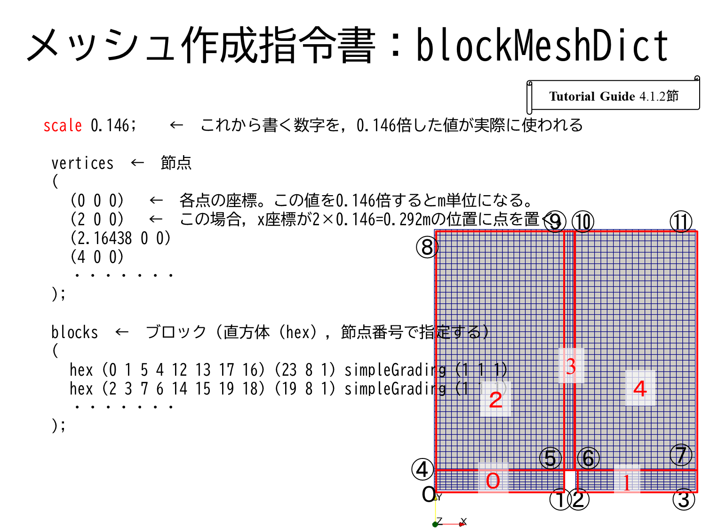
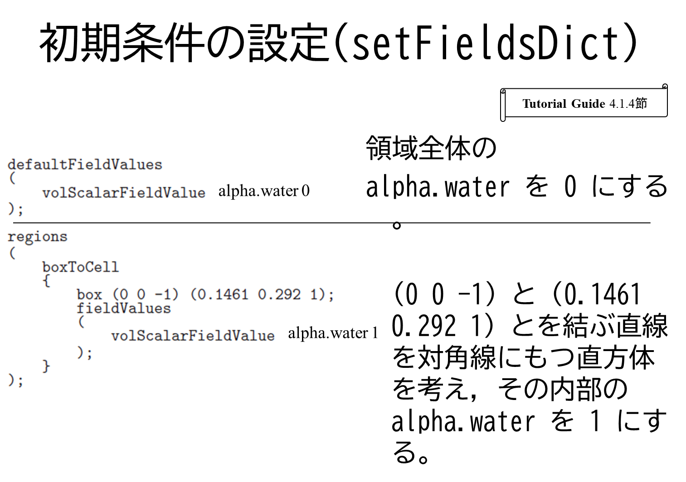

# OpenFOAMを効率よく使うために：設定ファイルの書き方の工夫

[toc]

## 概要

damBreak例題を使ってテストする。

テストのときの考え方
- 少しだけ変更して，実行する
- こまめに動作を確認する

## 作業一覧

- damBreak
    - 標準例題
- damBreak-dictTest01
    - blockMeshDictで変数を使ってみる
    - blockMeshDictでpatch・境界面の指定にブロック番号と面番号を使う
    - setFieldsDictでも変数を使ってみる
- damBreak-dictTest02
    - systemディレクトリにcaseSettingsという名前のファイルを作成する（任意名）
    - blockMeshDictの変数をsystem/caseSettingsファイルに記載
    - setFieldsDictの変数をsystem/caseSettingsファイルに記載
- damBreak-dictTest03
    - 他の設定にも`#include`を使ってみる
    - `blockMeshDict` で`defaultFaces`ではなく`empty`名の境界を作成する
    - 0.orig/の各変数で，`empty`境界条件を設定する
        – `#includeEtc "caseDicts/setConstraintTypes"`を使って指示する
    - `0.orig/U`ファイルで，初期値を`system/caseSettings`から読み込む
- 挑戦
    - 計算領域の大きさや形状を変える
    - 初期水柱の大きさや形状を，計算領域に合わせて適切に変更する

- damBreak-3D01
    - from 2D to 3D
- damBreak-3D02
    - change initial water region in system/caseSettings using `#eval{}`

## damBreak例題のディレクトリ・ファイル構成

```shell
./
├── 0.orig
│   ├── alpha.water
│   ├── p_rgh
│   └── U
├── Allclean
├── Allrun
├── constant
│   ├── g
│   ├── transportProperties
│   └── turbulenceProperties
├── system
　   ├── blockMeshDict
  　 ├── controlDict
  　 ├── decomposeParDict
  　 ├── fvSchemes
  　 ├── fvSolution
  　 ├── sampling
     └── setFieldsDict
```

## 設定ファイルと主な項目

設定ファイルと主な項目は次のようなものである。

1. blockMeshDict
	1. 計算領域位置，サイズ
	2. メッシュ分割数
2. setFieldsDict
	1. 初期配置領域
	2. 初期値
3. g
	1. 重力（計算領域の姿勢）
4. 各種変数
	1. 初期値
	2. 境界条件
5. transportProperties
	1. 流体の種類・物性値
6. その他

これらは，独立している場合だけでなく，相互に関係していることが多い。例えば，計算領域・モデルの大きさを変更したとき，初期配置領域なども変更することがある。

このような場合に，1つのファイルを変更したのに，別のファイルの変更を忘れることがある。あるいは，意図しない不整合な条件設定となることがある。

このようなリスクを避けるために，複数のファイルに記載する情報を1つのファイルにまとめることを考える。1つにまとめたファイルに条件を記入し，他のファイルはこの情報を読み取り，インクルードすることを目指す。

## damBreak例題概要

まずは，標準例題のdamBrakeの内容を確認する。次のような計算領域，メッシュが使われている。これらの図を見ながら，system/blockMeshDictを確認し，節点（vertices）として与える座標を把握する。

この図で，丸く囲った黒い数字は節点番号，赤い数字はブロック番号を示す。





## damBreak-dictTest01

ここでは，`blockMeshDict`と`setFileldsDict`の2つのファイルを順に修正していく。一部分を書き換えた後に，実行して動作することを確認するとよい。

### blockMeshDictで変数を使ってみる

標準例題のsystem/blockMeshDictで使われている座標の値を，変数に置き換える。例えば，各節点のx座標が0であるところを，変数`x0`と書き換えることにする。

`blockMeshDict`のはじめの方に，変数の定義を書く。変数とする記号の後にスペースを空けて，入れたい値を書く。項目の区切りはセミコロン`;`である。

このようにして定義した変数を使う部分では，変数の前に記号`$`を付ける。例えば `$x0` というように書く。節点のx座標の値が `0` であるところを，`$x0` に置き換えていく。

メッシュ分割数も変数に置き換える。

全てを置き換えると，次のように書き換えることになる。

```c++
scale   0.146;

x0 0; y0 0; z0 0; // Origin
x1 2; x2 2.16438; x3 4;
y1 0.32876; y2 4;
z1 0.1;

nx1 23; nx2 4; nx3 19;
ny1 8; ny2 42;
nz1 1;

vertices
(
    ($x0 $y0 $z0) // v0
    ($x1 $y0 $z0)
    ($x2 $y0 $z0)
    ($x3 $y0 $z0)
    ($x0 $y1 $z0)
    ($x1 $y1 $z0) // v5
    ($x2 $y1 $z0)
    ($x3 $y1 $z0)
    ($x0 $y2 $z0)
    ($x1 $y2 $z0)
    ($x2 $y2 $z0) // v10
    ($x3 $y2 $z0)
    ($x0 $y0 $z1)
    ($x1 $y0 $z1)
    ($x2 $y0 $z1)
    ($x3 $y0 $z1) // v15
    ($x0 $y1 $z1)
    ($x1 $y1 $z1)
    ($x2 $y1 $z1)
    ($x3 $y1 $z1)
    ($x0 $y2 $z1) // v20
    ($x1 $y2 $z1)
    ($x2 $y2 $z1)
    ($x3 $y2 $z1) // v23
);

blocks
(
    hex (0 1  5  4  12 13 17 16) ($nx1 $ny1 $nz1) simpleGrading (1 1 1) // b0
    hex (2 3  7  6  14 15 19 18) ($nx3 $ny1 $nz1) simpleGrading (1 1 1) // b1
    hex (4 5  9  8  16 17 21 20) ($nx1 $ny2 $nz1) simpleGrading (1 1 1) // b2
    hex (5 6 10  9  17 18 22 21) ($nx2 $ny2 $nz1) simpleGrading (1 1 1) // b3
    hex (6 7 11 10  18 19 23 22) ($nx3 $ny2 $nz1) simpleGrading (1 1 1) // b4
);
```

### blockMeshDictでpatch・境界面の指定にブロック番号と面番号を使う

標準例題では，境界面の指示において，面を構成する4つの節点番号を使っている。例えば，`(0 12 16 4)`と書く。この書き方が標準的であるが，別の表記方法も可能である。ここでは，ブロック番号と面番号の2つの数字で面を指定する方法を確認する。

`blockMesh -help`で表示される説明は次の通りである。ローカルx方向の最小面が0番，最大面が1番，といったように，面に番号が付けられる。

```shell
Block mesh generator.

  The ordering of vertex and face labels within a block as shown below.
  For the local vertex numbering in the sequence 0 to 7:
    Faces 0, 1 (x-direction) are left, right.
    Faces 2, 3 (y-direction) are front, back.
    Faces 4, 5 (z-direction) are bottom, top.

                        7 ---- 6
                 f5     |\     :\     f3
                 |      | 4 ---- 5     \
                 |      3.|....2 |      \
                 |       \|     \|      f2
                 f4       0 ---- 1
    Y  Z
     \ |                f0 ------ f1
      \|
       o--- X
```

`system/blockMeshDict`の`boundary`セクション内では，`faces`部分で面を指定する。古い方法では，4つの節点を1筆書きのような順で指示する。今回は，ブロック番号と面番号の2つの数字で指示することに挑戦する。前述の模式図に書いたブロック番号も参考にしながら書き換えると，次のようになる。

ブロック構成・ブロック番号を明確に意識していれば，こちらの方式の方が見やすく，書きやすくなる。節点の番号を覚える必要がなくなる。

```c++

boundary
(
    leftWall
    {
        type wall;
        faces
        (
            (0 0) //b0 f0 //(0 12 16 4)
            (2 0) //b2 f0 //(4 16 20 8)
        );
    }
    rightWall
    {
        type wall;
        faces
        (
            (1 1) //b1 f1 //(7 19 15 3)
            (4 1) //b4 f1 //(11 23 19 7)
        );
    }
    lowerWall
    {
        type wall;
        faces
        (
            (0 2) //(0 1 13 12)
            (0 1) //(1 5 17 13)
            (3 2) //(5 6 18 17)
            (1 0) //(2 14 18 6)
            (1 2) //(2 3 15 14)
        );
    }
    atmosphere
    {
        type patch;
        faces
        (
            (2 3) //(8 20 21 9)
            (3 3) //(9 21 22 10)
            (4 3) //(10 22 23 11)
        );
    }
    empty
    {
        type empty;
        faces
        (
            (0 4) (0 5)
            (1 4) (1 5)
            (2 4) (2 5)
            (3 4) (3 5)
            (4 4) (4 5)
        );
    }
);
```

### setFieldsDictでも変数を使ってみる

初期時刻において，一部の領域に水を配置（`alpha.water=1`と）する。標準例題では次のように記述されている。



ここでは，水を配置する領域を直方体とし，`boxToCell`方式で指定している。このとき，対角上の2点の座標が必要となる。その座標を，変数を使って与えてみる。（このファイルだけであれば変数にする必要性は小さい。しかし，複雑なケース設定では，計算領域・メッシュの指定（blockMeshDict）と初期設定（setFieldsDict）の両方を操作することがあり，それらを効率的に実施するための下準備である。）

```c++
// sf: set fields
sfX0 0;      sfY0 0;     sfZ0 -1;
sfX1 0.1461; sfY1 0.292; sfZ1  1;


defaultFieldValues
(
    volScalarFieldValue alpha.water 0
);

regions
(
    boxToCell
    {
        //box (0 0 -1) (0.1461 0.292 1);
        box ($sfX0 $sfY0 $sfZ0) ($sfX1 $sfY1 $sfZ1);
        fieldValues
        (
            volScalarFieldValue alpha.water 1
        );
    }
);
```


## damBreak-dictTest02

ここでは，先の例題で2つのディクショナリで定義した変数を，1つの別のファイルで定義する方法を確認する。これによって，1つのファイルの修正だけで，2つのユーティリティへの指示が完了することになる。

1. systemディレクトリにcaseSettingsという名前のファイルを作成する（任意名）
2. blockMeshDictの変数をsystem/caseSettingsファイルに記載
3. setFieldsDictの変数をsystem/caseSettingsファイルに記載

```c++:system/caseSettings
// ------------------------
// blockMesh

scale   0.146; //Caution: this applies only to blockMeshDict.

x0 0; y0 0; z0 0; // Origin
x1 2; x2 2.16438; x3 4;
y1 0.32876; y2 4;
z1 0.1;

nx1 23; nx2 4; nx3 19;
ny1 8; ny2 42;
nz1 1;


// ------------------------
// setFields

sfX0 0;      sfY0 0;     sfZ0 -1;
sfX1 0.1461; sfY1 0.292; sfZ1  1;


// ---------------------------
// etc.
```

注意が必要な点が1つある。それは，`scale`の使われ方である。`blockMeshDict`に`scale`を記載すると，節点の座標の値に`scale`を掛けたものが実際の値になる。

一方，`setFieldsDict`には，この`scale`事態は影響しない。そのため，`setFieldsDict`内では，実際の（必要に応じてスケール変換した後の）座標値を使用する。

もし，`setFiledsDict`に使用する数値も`scale`を使って表現したい場合には，次の例題で使用する`#eval{}`構文を使って，計算式を記述することができる。


## damBreak-dictTest03

1. 他の設定にも`#include`を使ってみる
2. `blockMeshDict` で`defaultFaces`ではなく`empty`名の境界を作成する
3. 0.orig/の各変数で，`empty`境界条件を設定する
    1. `#includeEtc "caseDicts/setConstraintTypes"`を使って指示する
4. `0.orig/U`ファイルで，初期値や境界条件を`system/caseSettings`から読み込む
## 挑戦
    - 計算領域の大きさや形状を変える
    - 初期水柱の大きさや形状を，計算領域に合わせて適切に変更する

## damBreak-3D01
    - from 2D to 3D
    - 境界条件を正規表現によって一括指定する

### よく見かける正規表現

名前A，名前B，名前Cのいずれかにマッチする→全てを指示する
    `"(名前A|名前B|名前C)"`

OpenFOAMで使われている例
    `"(名前A|名前B|名前C)追加名D"`

カッコ()はグループ化，パイプ`|`は論理和（または）

全ての名前（OpenFOAMでは，明示的に指定した名前は外される。）
    `".*"`

`"*"` ではダメなのか？ダメ．

<!-- 
"*."wall
-->

`.` ワイルドカード　任意の1文字（改行文字を除く）
`*` 直前の文字やグループが0回以上繰り返される

https://developer.mozilla.org/ja/docs/Web/JavaScript/Guide/Regular_expressions/Cheatsheet

## damBreak-3D02
    - change initial water region in system/caseSettings using `#eval{}`

## どうやって

`#include`指示を使ってファイルを読み込む。

一般的な設定は，`#includeEtc`が使えるか？

一般的な名前を付けた境界条件

https://gitlab.com/openfoam/core/openfoam/-/blob/master/etc/caseDicts/setConstraintTypes?ref_type=heads

## 参考になる情報

いろいろなDictのサンプル
https://gitlab.com/openfoam/core/openfoam/-/tree/master/etc/caseDicts/annotated?ref_type=heads

たとえば，blockMeshDict
https://gitlab.com/openfoam/core/openfoam/-/blob/master/etc/caseDicts/annotated/blockMeshDict?ref_type=heads


## 注意点

不要なエントリーが存在しても，エラーにはならない。

同じエントリーが複数存在しても，エラーにはならない。後のものが使われる。
