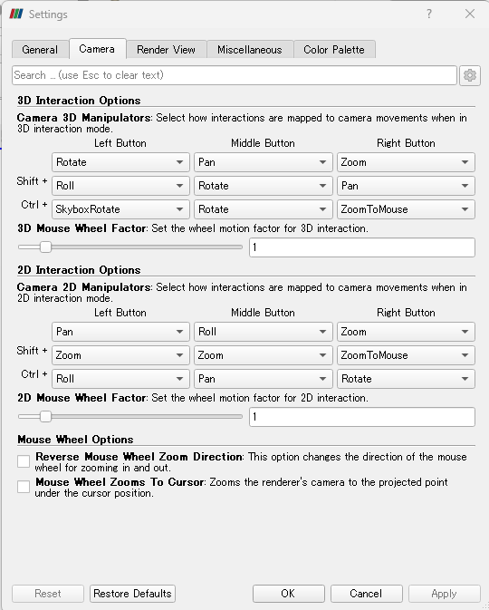
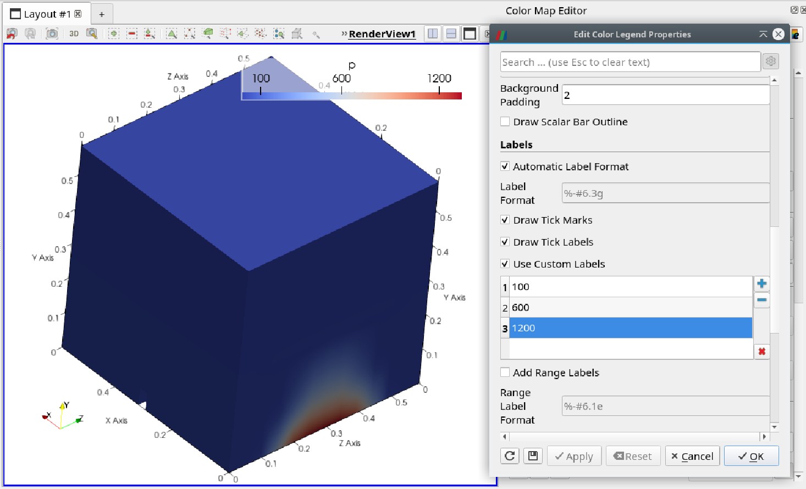
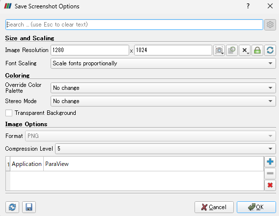

# ParaViewの第一歩：基本設定と操作

[toc]

## 概要

ParaViewをつかい始めた初心者のために，知っていると良いことをお知らせする。毎年新たな初心者と接する中で筆者が個人的に考えたことなので，これが正しいとは限らない。

## マウス操作の確認

マウス操作とカメラの関係は，Settings - Camera で確認できる。変更することも可能である。なお，`Pan`は回転させない平行移動，`Rotate`は回転，`Zoom`は拡大縮小である。

## 個人的にお勧めする設定

### 基本設定（Render View）

Render viewでの表示の仕方・オプションとして，次の2つをお勧めする。

- `Axes Grid`: ON
    - 領域の大きさを正確に把握しやすい
    - メッシュ作成ミスなどの早期発見につながる（寸法を定量的に見る）
- `Camera Parallel Projection`: ON
    - 位置を正確に把握しやすい
    - `Layout`の3D表示を2D表示にしても，サイズが変らない

　以上の2つの設定は，ParaViewのデフォルトではOffとなっている。変更した設定をデフォルト値として保存することもできる。`Pipeline Browser` の下の`Properties`タブで `View (Render View)` という部分の横にある保存（ディスク）アイコンをクリックすると，初期値として保存される。その左にある再読込（回転する矢印）アイコンをクリックすると，ParaViewの初期に戻る。

[ParaView Manual: custom-default-settings](https://docs.paraview.org/en/v5.11.2/ReferenceManual/customizingParaView.html#custom-default-settings)

### 色

Render Viewで表示する色の組み合わせ（`Color Palette`）を変更できる。好みの問題であるが，背景が白の方が扱いやすいことがある。 (印刷するとき，トナー節約になるか？）変更方法は次の通りである。

`Edit` - `Settings` - `Color Palette` タブを選択する。

下の方にある`Load Palette`で `White Background`を選択する。

### データの表示方式

ポイント表示ではなく，まずは，セル表示を選択する。生の計算データを確認するために。

表示方法（あるいは，内部でのデータの保持方法）については，ParaView公式ユーザーガイドの下記部分に説明があります。「セル表示」に対して，「ポイント表示」という表現ができます。ユーザーガイドをご確認ください。

[https://docs.paraview.org/en/latest/UsersGuide/understandingData.html#attributes-fields-arrays](https://docs.paraview.org/en/latest/UsersGuide/understandingData.html#attributes-fields-arrays)

### セルを正しく表示

OpenFOAMのデータ構造とParaViewのデータ構造が異なるため，適切に設定しないと，セルの形状が正確に表示されない。（余計な線が引かれる。）

`Pipeline Browser` の下の`Properties`タブで 読み込む変数選択部分のすぐ下に `Decompose polyhedra` がある。このチェックを外す。［ParaView 6では，何もせずにキレイな表示になる。］

基本的には，`decompose`や `triangulate` のチェックを外すことで，余分な線が表示されない。

`Clip` や `Slice` Filterを適用したときは，`Crinkle *` を有効にするときれいに表示される。ただし，でこぼこすることがある。（Parallel Projectionしておくときれいに見える可能性が高まる。）

`Slice`の時，`Triangulate the slice` のチェックを外すと改善する。

### ベクトル

#### ベクトル（Glyph）の前に`Cell Centers`

セル重心位置にベクトルの始点を置くためには，事前に`Cell Centers`フィルタを適用する。生のデータを確認するときには必要である。

## 使い方

### annotation いろいろ

https://docs.paraview.org/en/latest/ReferenceManual/annotations.html

- Annotation sources
  - Text source
  - Annotate Time source
- Annotation filters
  - Annotate Attribute Data filter
  - Annotate Global Data filter
  - Annotate Time Filter
  - Environment Annotation filter
  - Python Annotation filter

#### Annotate Time source と Annotate Time filter

`Annotate Time source`では，時間をそのまま表示する。`Annotate Time filter`では，そのまま表示だけでなく，`shift`や`scale`を使える。これによって，秒だけでなく，ミリ秒，分，または，時間といった任意の単位での表示ができる。

`“Time: {time:f}”`  という表記の意味：`{}`内部の`time`は，ParaView内部の現在の時刻の値に置き換えられる。`:f`は浮動小数点を6桁で表示することを指示している。このような表示方法・formatの指示方法については，Pythonのフォーマットライブラリ {fmt} に説明されている。

https://fmt.dev/dev/syntax/

#### 文字の背景色

`Font Properties`設定部分に`Show Background`設定がある。デフォルトでは`Only on hover`となっており，文字の位置を移動させている間だけ表示される。

この背景色を常に表示させたいときは，`Always`を選択する。

その下にある`Background Properties`で，色や大きさなどを設定できる。色の選択部分で透明度（`Alpha channel`）も変更できる。数字は0から255の範囲で変更する。

#### Environment Annotation filter

開いたデータファイル名や日付などを選択して表示できる。

#### Python Annotation

ある点[22]での圧力の値を表示するExpression例：
    'Pressure: %f Pa' % (p[22].Arrays[0])

https://fmt.dev/dev/syntax/

### ベクトルを任意の断面，指定した間隔で

`Resample With Dataset`フィルタを使用する。このフィルタは，2つの入力を必要とする。1つはベクトルを書くための元データ，もう1つはベクトルを置く場所を指示するデータである。

- `Source Data Arrays` には，可視化したいデータを選ぶ
- `Destination Mesh` には，ベクトルを配置したい位置を示す形状などを選ぶ。平面，円筒など。

`Resample With Dataset`を適用すると，`Pipeline Browser`には3つの`Resample With Dataset`が表示される。その内2つは先頭に左下向きの矢印アイコンがついていて，元データとの紐付けを示す。もう1つの`Resample With Dataset`を表示することで，任意の形状・面で値を表示できる。このフィルタに対して，`Glypy`フィルタを適用することで，任意断面に任意の間隔でベクトルが表示できるようになる。

### Color Legend

#### 両端の数値の表示方法を設定する

`Edit Color Map` - `Edit Color Legend Properties` （詳細設定を有効にする）
- `Add Range Labels` - `Range Label Format: %-#6.1f` （eをfに：指数表示から実数表示）
    - `Color Legend` の両端だけ，表記が異なることを防ぐ
    - 表示文字数が多いのが気になるときに有効
    - データによっては不適切な場合も

#### 表示するメモリ・ラベルを指定する

`Edit Color Legend Properties`の中に，`Use Custom Labels`という項目がある。これを有効にして，表示したいラベルを追加する。ここに追加したラベルだけが表示されるようになる。（Range Labelsは別設定）

#### 背景色を設定する

`Edit Color Map` - `Edit Color Legend Properties` （詳細設定を有効にする）

`Appearance`の`Draw Background`を有効にする。色を選択する項目が表示される。ここから色を選択したり，透明度（`Alpha channel`）を変更できる。数字は0から255の範囲で変更する。

### 全体の確認時

開いたデータファイルは `Feature Edges` 表示で，全体の大きさ・外形が想像できるだけの表示にする。内部の情報を可視化したものと同時に表示する。

### VOF法計算での液面の表示

- Contoursフィルタで液体積率（`alpha.water`など）の等値面（値は0.5）を表示する
- Thresholdフィルタで液体積率（`alpha.water`など）が0.5以上（Above Upper Threshold）にする。

#### Slice面で液面位置を表示したい

- Slice面上で`Contour`を適用して，水面相当位置を描く
- そのContourの`Properties`タブで，`Styling`欄にある`Line Width`の値を大きくして，線幅を太くする
- 同じContourの色づけを`Solid Color`にして，Editから好きな色に変える

### 保存する画像のFontサイズ

保存時の詳細設定に，Font scalingという設定項目がある。デフォルトでは`Scale fonts proportionally`となっている。

使用するマシンのディスプレイ設定において，拡大/縮小が100％の場合には，この影響はなさそう。（ParaViewのViewーPreviewで設定したサイズがディスプレイサイズ以下で，スケールが適用されていない状態で確認した。）

#### ParaViewのViewーPreviewで設定したサイズがディスプレイサイズ以上で，アスペクト比を維持するようにスケールされた（画面表示が小さくなっている）場合

デフォルト設定では，フォントが画面よりも大きく感じられる。画面よりも大きな画像として書き出しており，フォントも大きく拡大されるためか。（そのスケールよりも大きな文字になっているように感じるが。）

`Do not scale fonts`を選択した場合，ParaViewの元の画面（Previewでないとき）のフォントサイズで書き出されているようだ。

詳細設定表示：Font scalingはScale fonts proportionallyとなっている。

